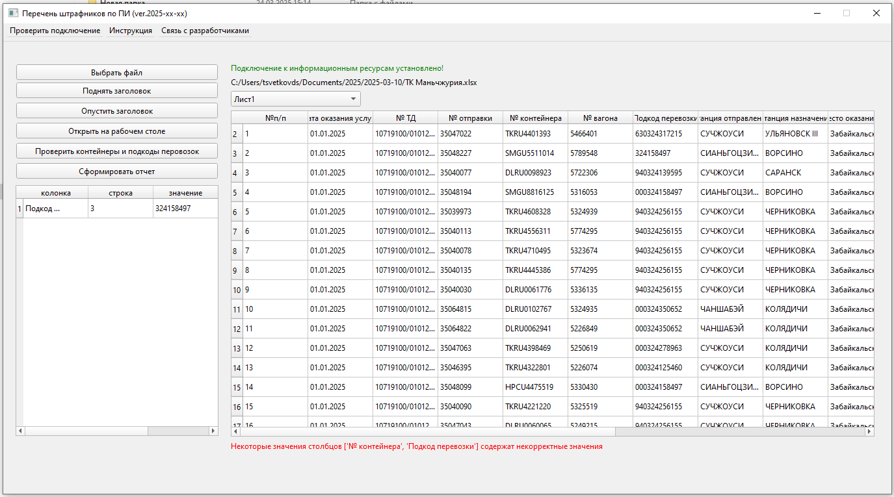

# Назначение
Программа предназначена для сбора статистики по клиентам, которые не выполняют условия договора ТЭО в части предоставления предварительной информации о товарах.

# Предополагаемый режим пользования
Предполагается что программа будет запускаться один раз в неделю для нескольких (до 10 файлов) за один заход.

# Описание программы
Программа представляет собой исполняемый exe-файл, предназначенный для запуска в OS Windows.
Взаимодействие с программой осуществляется через графический интерфейс (**далее GUI**):

Программа принимает исходные данные в виде таблицы Эксель, к которой добавляет . Результат выгружается в Эксель-файл.
**Для того чтобы программа работала, пользователю нужно подключиться к базе данных "стоящей" за iSales-3 с грантом позволяющим читать данные из таблицы equipments_docs.**

# Подлключение к базе данных.
При первом запуске программы в папке с программой генерируется пара ключей ассинхронного шифрования. Приватный ключ сохраняется в файле **private_key.pem**. Публичный ключ, вместе со списком параметров необходимых для подключения (хост, порт, имя БД, имя пользователя, пароль) записываются в файл **auth_request**. Этот файл передаётся сотруднику ответственному за предоставление доступа, который с помощью специально разработанной для СЕМЕЙСТВА ПОЛЬЗОВАТЕЛЬСКИХ ПРИЛОЖЕНИЙ ОПЕРАТИВНОЙ АНАЛИТИКИ И АВТОМАТИЗАЦИИ (далее СППОАА) ПРОГРАММЫ СОЗДАНИЯ ФАЙЛА АУТЕНТИФИКАЦИИ (далее ПСФА) (полные сведения о ПСФА содержатся в репозитории: [https://git.trcont.ru/TsvetkovDS/make_auth_file](https://git.trcont.ru/TsvetkovDS/make_auth_file)) формирует файл **auth_response**.
Файл **auth_response** содержит параметры подключения зашифрованные публичным ключом.
Сотрудник ответственный за предоставление доступа предоставляет файл пользователю программы, который помещает его в одну папку с ней.
Таким образом данные подключения известны только сотруднику предоставляещему доступ и, при этом не "зашиты" в код программы.

# Пользовательский интерфейс (GUI).
GUI позоволяет выбрать исходную книгу эксель в файловой системе локальной машины и лист этой книги содержащей исходные данные.
Заголовки таблицы могут находится не в первой строке листа. Интерфейс позволяет "поднять" или "опустить" таблицу, чтобы заголовки оказались в перовой строке.
Так же можно открыть исходный файл с помощью интерфейса, чтобы облегчить поиск его в файловой системе, если этот файл нужно откорректировать.
**После изменения и сохранения изменений в исходном файле его следуте заново загрузить в программу!!!**

# Описание алгоритма
В случае наличия в одной папке с программой корректного файла **auth-response**, программа считывает с помощью запроса 
`select * from equipments_docs`
содержимое таблицы **equipments_docs** в датафрейм, который хранится в оперативной памяти локальной машины пользователя программы.
Пользователь загружает таблицу Эксель, данные к которой нужно подтянуть. После проверки корректности исходных данных, данные из и исходной таблицы и данные из БД  iSales-3 объединяются. Обработка происходит на локальной машине пользователя и не создаёт нагрузку на БД iSles-3.


# Инструкция по созданию исполняемого файла из файлов репозитория исходного кода

* Скопируйте проект из репозитория на локальный компьютер с предустановленным >=Python3.10<=Python3.12 (на 2025-02-09 для python3.13 библотеки загруженные через pip "отказывались" работать и требовали обнавления некоторых компонентов Windows)
* Перейдите в папку проекта
```cd ~\...\list_of_penalties```

* Создайте виртуальное окружение
```python -m venv .venv```

* Активируйте виртуальное окружение
```.venv/Scrits/activate```

* Установите зависимости
```pip install -r requirements.txt```

* Запустите auto-py-to-exe 
```auto-py-to-exe```
Выберите файл list_of_penalties.py,
задайте параметры "One File", "Window DBased (hide hte console)"
Нажмите "CONVERT .PY TO .EXE".

Исполняемый файл появится во вложенной папке ~\...\list_of_penalties\output\list_of_penalties.exe